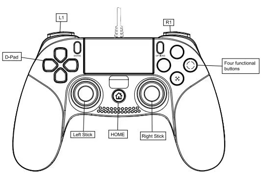
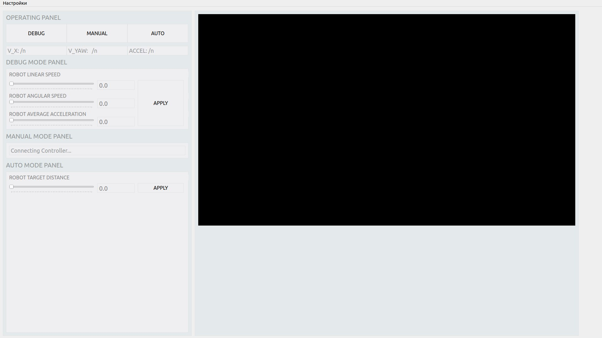

# Программное обеспечение гусенечного робота 2.0 (Crawler Bot Software)
Пакет экосистемы Robot Operating System 2 (ROS2) для гусеничной трекер платформы.
## Введение
ПО предназначено для управления с верхнего программного уровня. В качестве платформы для развертывания на роботе
установлен одноплатный микрокомпьютер NVIDIA Jetson Nano с операционной системой Ubuntu 22.04.03 LTS (Jammy Jellyfish),
и установленной на борту камерой RealSense D415.
> ПРИМЕЧАНИЕ!  
> Текущая версия ПО в этой ветке предназначена для установки в платформу на одноплатный компьютер NVIDIA Jetson Nano,
> с установленной Ubuntu 22.04 и ROS2 Humble.

Весь функционал реализован в популярной среде функционирования роботов ROS2 Humble. Реализовано 3 режима работы 
платформы:
* Отладочный режим (Debug mode) - режим, в котором управление роботом осуществляется через терминал Ubuntu путем 
обращения к параметрам ROS2 и изменению их. Ниже будут перечислены все доступные параметры взаимодействия с роботом. 
* Режим ручного управления (Manual mode) - режим, в котором управление роботом осуществляется посредством контроллера. 
В данный момент реализована поддержка контроллера Playstation 4 (Dualshock 4, DS4). Схема управления при помощи геймпада 
приведена ниже.
* Автоматический режим (Auto mode) - беспилотный режим управления, в котором робот выполняет задачу трекинга объекта 
на изображении с его камеры и следует за этим объектом, держась на определенном расстоянии. В данный момент реализовано 
распознавание человека и следование за ним, используя предобученную нейронную сеть. (В будущем планируется 
распознавание и следование за логотипом РЦР ДГТУ).
> Пакет лишь задаёт параметры управления роботом, напрямую с исполнительными органами (моторами, актуаторами, 
> сервоприводами и т.д.) не взаимодействует. При этом он также не обеспечивает связь верхнего уровня (компьютер) и 
> нижнего (микроконтроллер). Подразумевается лишь передача топиков, которые ПО передает на нижний уровень через microROS
> (запускается отдельно).
## Установка
Предварительно необходимо создать локальную среду ROS2 на компьютере, если у вас ее еще нет:
   ``` 
   mkdir -p ~/dev_ws/src
   ```
Также нужны пакеты python3:  
   ``` 
    pip install pyPS4controller  
    pip install opencv-python
    pip install pyrealsense2  
    pip install ultralytics 
   ```  
Далее:
1. Перейти в папку локальной среды ROS2
    ```
    cd ~/dev_ws/src
    ```
2. Клонировать репозиторий
    ```
    git clone https://github.com/RCR-DSTU/crawler-bot-software.git
    ```
3. Перейти в папку проекта
    ```
   cd crawler-bot-software
    ```
4. Переключить ветку проекта на jetson2.0
    ```
   git switch jetson2.0
    ```
5. Вернуться в рабочую среду ROS2
    ```
    cd ~/dev_ws
    ```
6. Забилдить проект
    ``` 
    colcon build
    ```
7. Засорсить глобальную среду ROS2 в текущую оболочку
    ```
    source /opt/ros/foxy/setup.bash
    ```
8. Засорсить локальную среду ROS2 в текущую оболочку
    ```
    . install/setup.bash
    ```
## Запуск
Запуск программы осуществляется файлом запуска `robot.launch.py`:

   ```
   ros2 launch crawler_bot robot.launch.py
   ```
Начинается запуск нод: драйвера камеры Realsense, детектора объектов на изображении, контроллера управления роботом, драйвера геймпада и графического интерфейса.

## API
## Robot Node
### Получаемые топики
| Название                     | Тип сообщения       | Описание                                                                     |
|------------------------------|---------------------|------------------------------------------------------------------------------|
| /detector/raw_auto_twist     | geometry_msgs/Twist | Требуемые скорости движения в автоматическом режиме, рассчитанные детектором |
| /controller/raw_manual_twist | geometry_msgs/Twist | Требуемые скорости движения в ручном режиме по геймпаду                      |
### Отправляемые топики
| Название          | Тип сообщения       | Описание                                    |
|-------------------|---------------------|---------------------------------------------|
| /CrawlerBot/twist | geometry_msgs/Twist | Линейные и угловые скорости движения робота |
### Основные параметры

| Название               | Тип переменной | Описание                                                                    |
|------------------------|----------------|-----------------------------------------------------------------------------|
| operating_mode         | integer        | 3 режима соответствуют значениям: DEBUG - 0, MANUAL - 1, AUTO - 2           |
| manual_mode_timeout    | integer        | Таймаут режима, если геймпад не будет подключен, активируется режим отладки |
| auto_mode_timeout      | integer        | Таймаут режима, если камера не будет подключена, активируется режим отладки |
| frequency              | integer        | Частота работы ноды                                                         |
| debug_linear_velocity  | double         | Линейная скорость робота во время отладки                                   |
| debug_angular_velocity | double         | Угловая скорость робота во время отладки                                    |
| max_linear_velocity    | double         | Максимальная линейная скорость робота                                       |
| min_linear_velocity    | double         | Минимальная линейная скорость робота                                        |
| max_angular_velocity   | double         | Максимальная угловая скорость робота                                        |
| min_angular_velocity   | double         | Минимальная угловая скорость робота                                         |
Параметры: `operating_mode, debug_linear_velocity, debug_angular_velocity`, можно изменять в любой момент работы робота через терминал. 

Пример изменения параметра в терминале:   
    ```
    ros2 param set crawler_bot operating_mode 1
    ```
### Описание режимов
* Отладочный (DEBUG). Работа в этом режиме позволяет изменять скорость движения робота путем задания параметров:
    - `crawler_bot/linear_velocity` - движение робота вдоль оси x, диапазон значений -1.0 ... 1.0 
    - `crawler_bot/angular_velocity` - движение робота вокруг оси z, диапазон значений -1.0 ... 1.0
* Ручной (MANUAL). Работа в этом режиме позволяет изменять скорость движения робота путем отклонения правого 
стика геймпада, причем отклонения влево-вправо изменяют улговую скорость, вверх-вниз - линейную. Так же в этом режиме 
доступно переключение на любой другой режим путем нажатия стрелок вверз (AUTO), вниз (DEBUG). Кнопка Share позволяет 
включать и выключать камеру. На рисунке ниже 
приведена схема управления геймпадом.  
  
    - `R2` Нажатие задает линейную скорость робота вперед вдоль оси х, диапазон значений 0 ... 1.0.
    - `L2` Нажатие задает линейную скорость робота назад вдоль оси х, диапазон значений -0 ... 1.0.
    - `Right stick` Движение стика влево/вправо задает угловую скорость вокруг оси z, диапазон значений -1.0 ... 1.0.
    - `Share` Нажатие кнопки включает/выключает отображение картинки с камеры.
    - `D-Pad Arrow up` Нажатие на кнопку переключает режим в Автоматический.
    - `D-Pad Arrow down` Нажатие на кнопку переключает режим в Отладочный.
* Автоматический (AUTO). Работа в этом режиме позволяет в автономном режиме роботу следовать за объектом, который 
распознается на изображении камеры.
## Realsense Node
Подключение к камере с помощью библиотеки pyrealsense2 и транслирование изображений глубины и цвета в топики.
### Отправляемые топики
| Название               | Тип сообщения               | Описание                                                                           |
|------------------------|-----------------------------|------------------------------------------------------------------------------------|
| /realsense/color_image | sensor_msgs/CompressedImage | Сжатое цветное изображение с камеры для детектирования объекта следования          |
| /realsense/depth_image | sensor_msgs/CompressedImage | Сжатое изображение глубины с камеры для измерения расстояния до объекта следования |
### Основные параметры

| Название     | Тип переменной | Описание                                               |
|--------------|----------------|--------------------------------------------------------|
| frequency    | integer        | Частота работы ноды                                    |
| image_width  | integer        | Ширина изображения для потока камеры                   |
| image_height | integer        | Высота изображения для потока камеры                   |
| print_fps    | bool           | Флаг активирующий отображение частоты кадров в консоле |

Параметры `image_width, image_height` могут быть либо: 640, 480, либо: 1280, 720 (если камера подключена по USB 3.2).
Параметр `print_fps` нужен в основном для отладки, показывает частоту кадров камеры.

## Detector Node
Нода распознает на изображениях положение и расстояние до объекта следования с помощью нейронной сети YOLOv8 (на данный момент доступно только распознавание человека). 
После распознавания рассчитывает скорость движения робота для следования. 
### Получаемые топики
> см. `Realsense Node` -> `отправляемые топики`
### Отправляемые топики
> см. `Robot Node` -> `получаемые топики` -> `/detector/raw_auto_twist`
### Основные параметры
| Название                  | Тип переменной | Описание                                                                              |
|---------------------------|----------------|---------------------------------------------------------------------------------------|
| frequency                 | integer        | Частота работы ноды                                                                   |
| detecting_class           | string         | Название класса для распознавания                                                     |
| target_x                  | integer        | Значение пикселя по вертикальной оси изображения, в котором держать объект следования |
| target_z                  | double         | Расстояние от камеры на котором держать объект следование                             |
| linear_proportional_term  | double         | P-коэффициент регулятора линейной скорости                                            |
| angular_proportional_term | double         | P-коэффициент регулятора угловой скорости                                             |

## Gui Node
Графический интерфейс для управления роботом, рисунок ниже.
  

``OPERATING PANEL`` Кнопки выбора режима управления, текущие скорости и ускорение робота.  
``DEBUG MODE PANEL`` Слайдеры регулировки скорости и ускорения в режиме отладки, кнопка подтверждения параметров.  
``MANUAL MODE PANEL`` Строка состояния подключения геймпада.  
``AUTO MODE PANEL`` Слайдер регулировки целевого расстояния до объекта следования, кнопка подтверждения параметра.  
``IMAGE`` В окне справа транслируется изображение с камеры.